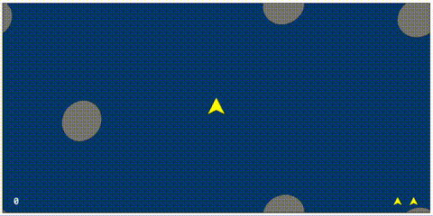

# Rocks

An asteroids clone.

## Setup

1. Check out this repository to `/<PATH>/rocks/`.
2. Open `file:///<PATH>/rocks/index.html` in your browser.

## How to play

**Up** and **Down** arrows accelerate and decelerate.
**Left** and **Right** arrows yaw.
**Space** shoots.

## About

The goal of this project was to write a simple, playable arcade game from start to finish in a reasonable amount of time. Game design patterns are pretty foreign to me, and I wanted to see what was involved in writing a general-purpose engine.
